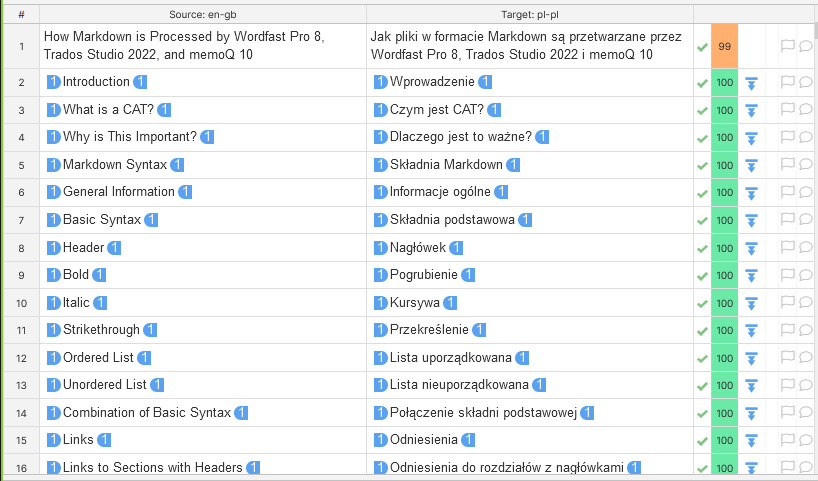
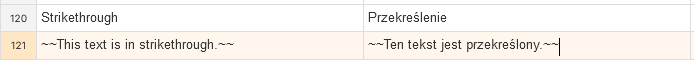
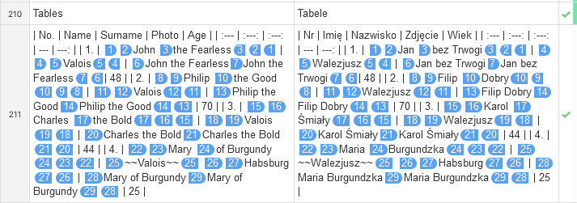

Phrase
===

# Phrase — Results

This section contains the results for the settings available in Phrase.

<!-- REUSE COMP BGN -->
The results for individual settings are grouped according to the sections in the test file. If a feature is not mentioned, it means it works as intended — it was imported correctly into the editor and produced correct output in the exported file.

The test was carried out by checking the boxes in the settings. This made Phrase import more features and allowed more editing. However, if a feature started working, this is noted in the relevant section.

**IMPORTANT**:  Not every Markdown formatting, e.g. `^superscript^`, works in GitHub preview. The fact that a feature does not work in GitHub preview does not mean it is caused by the incorrect output from the CAT.

<!-- REUSE COMP END -->

# General results

Phrase editor shows the majority of Markdown formatting only as tags:



*Figure 1: tags in Phrase*

Links to websites are ignored and not displayed as tags. However, the alt text for URLs is tagged.

There is often a discrepancy between what is seen in the editor and what actually works or does not work in the output file.

# [Plain](Markdown-in-CAT-test-PH_PL-01.md)

<!-- No generalnie tutaj trochę miałem polew, jak zobaczyłem plik docelowy :) IMO mogliby to schować albo przerobić, bo nawet prosta składnia ledwo działa :exploding_head: -->

## Basic syntax

<kbd>&#128680;REALLY!</kbd>: Strikethrough is rendered normally:



*Figure 2: strikethrough rendered normally*

<kbd>&#128680;REALLY!</kbd>: Ordered lists do not work. Backslash is entered in the output file which turns off the list:
```
Oto przykład listy uporządkowanej: 1\. Pozycja 1 2. Pozycja 2 3. Pozycja 3 1. Podpozycja 3.1 2. Podpozycja 3.2.
```

<kbd>&#128680;REALLY!</kbd>: Unordered lists do not work in the output file:
```
Oto przykład listy nieuporządkowanej: - Pozycja 1 - Pozycja 2 - Pozycja 3 - Podpozycja 3 - Podpozycja 3
```

The rest works as intended.

## Links

Reference does not work: the content in round brackets in `[Składnia podstawowa](#basic-syntax)` is not translatable.

URLs are rendered normally.

The rest works as intended.

## Quotations

Code block was rendered normally.

<kbd>&#128680;REALLY!</kbd>: As a result, the escape sign `\` was inserted in front of every backtick {\`} symbol in the output file — code block does not work in the output.
```
Składnia: \`\`\`
# Nagłówek 1
## Nagłówek 2
### Nagłówek 3
\`\`\`
```

The rest works as intended or as above.

<kbd>&#128680;REALLY!</kbd>: Inline code works and its content can be translated.

## Extended syntax

Table syntax is rendered normally:


*Figure 3: table syntax in Phrase editor*

As a result, the table does not work in the output file.

The task list does not work in the output file because it uses the syntax of an unordered list.

Emoji is rendered normally.

<kbd>&#128680;REALLY!</kbd>:  Despite of the various issues mentioned above, it is surprising that emoji works in the output file.

Comments to be omitted are ignored.

The rest works as intended.

## HTML and other tags

A Markdown table in the collapsed section does not work.

<kbd>&#128680;REALLY!</kbd>: However, other Markdown formatting works in the collapsed section.

HTML is rendered normally. Otherwise, it works as intended in the output file

<kbd>&#128680;REALLY!</kbd>: Because code block does not work, the embedded HTML is shown twice in the output file.

The rest works as intended.

# [PHP/Python Markdown extra](Markdown-in-CAT-test-PH_PL-02.md)

## Basic syntax

Basic syntax works as intended or as above.

<kbd>&#128680;REALLY!</kbd>: Indeed, lists do not work here either.

## Links

The links work as intended or as above.

## Quotations

Code block works as intended and it can be translated. All Markdown, HTML, and JavaScript code is rendered normally.

The rest works as intended or as above.

## Extended syntax

Tables work as intended.

Footnotes work as intended.

The rest works as intended or as above.

## HTML and other tags

HTML and other tags work as intended or as above.

# [GitHub flavored Markdown](Markdown-in-CAT-test-PH_PL-03.md)

## Basic syntax

Ordered lists work as intended.

Unordered lists work as intended.

The rest works as intended.

## Links

The links work as intended or as above.

## Quotations

Quotations work as intended or as above.

## Extended syntax

Footnotes do not work.

The rest works as intended or as above.

## HTML and other tags

The Markdown table works in the collapsed section.

HTML and other tags work as intended or as above.

**IMPORTANT:** This flavour setting works best out of the three, so it will be used in further study.

# [Preserve whitespaces](Markdown-in-CAT-test-PH_PL-04.md)

Generally, the segmentation changed, but the output file is similar as in the [GitHub flavoured Markdown](#Settings-github-flavored-markdown) setting.

As a result, no detailed study is presented.

# [Exclude code elements](Markdown-in-CAT-test-PH_PL-05.md)

Generally, this setting works similarly to [GitHub flavoured Markdown](#Settings-github-flavored-markdown) with one exception.

Inline code is ignored.

As a result, no detailed study is presented.

# [Exclude code elements with unchecked import code blocks](Markdown-in-CAT-test-PH_PL-06.md)

Generally, this setting works similarly to [Exclude code elements](#settings-exclude-code-elements) with one exception.

Block code is ignored.

As a result, no detailed study is presented.

---

Go to section: [*Phrase — summary and recommendations*](phrase-03-summary-and-recommendations.md)

---

[Back to top](#phrase-results)