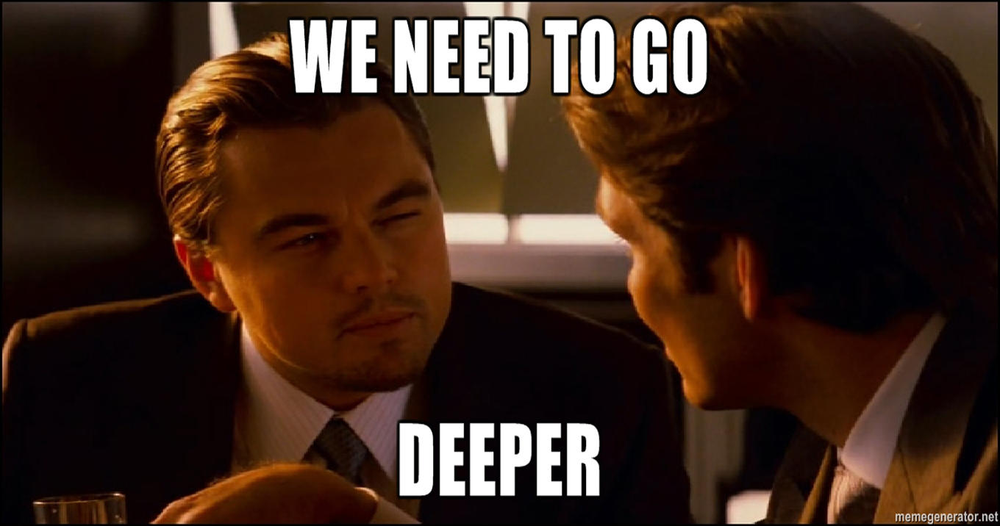

Jak pliki w formacie Markdown są przetwarzane przez Wordfast Pro 8, Trados Studio 2022 i Phrase<!-- omit in toc -->
===

<!-- This here is a comment. And I'd like to create a TOC below -->
<!-- Use this: https://www.markdownguide.org/cheat-sheet/ -->
<!-- Things I need to insert:
- HTML tags, like <code></code>
- (funny thing that markdown kinda works here)
-  -->

- [Wprowadzenie](#introduction)
  - [Czym jest CAT?](#what-is-a-cat)
  - [Dlaczego jest to ważne?](#why-is-this-important)
- [Składnia Markdown](#markdown-syntax)
  - [Informacje ogólne](#general-information)
  - [Składnia podstawowa](#basic-syntax)
    - [Nagłówek](#header)
    - [Pogrubienie](#bold)
    - [Kursywa](#italic)
    - [Przekreślenie](#strikethrough)
    - [Lista uporządkowana](#ordered-list)
    - [Lista nieuporządkowana](#unordered-list)
    - [Połączenie składni podstawowej](#combination-of-basic-syntax)
  - [Odniesienia](#links)
    - [Odniesienia do rozdziałów z nagłówkami](#links-to-sections-with-headers)
    - [Odniesienia do plików](#links-to-files)
    - [Odniesienia do plików graficznych](#links-to-images)
    - [Odniesienia do stron www](#links-to-websites)
    - [Odniesienia do materiałów wideo na YouTube](#links-to-youtube)
    - [Odnośniki z tekstem podpisu](#links-with-hover-text)
    - [Składnia dotycząca odniesień](#syntax-for-links)
  - [Cytowanie](#quotations)
    - [Cytat blokowy](#blockquote)
    - [Wiersz kodu](#inline-code)
    - [Blok kodu](#code-block)
  - [Składnia rozszerzona](#extended-syntax)
    - [Tabele](#tables)
    - [Lista zadań](#task-list)
    - [Emoji](#emoji)
    - [Wyróżnienie](#highlight)
    - [Indeks dolny](#subscript)
    - [Indeks górny](#superscript)
    - [Przypisy](#footnotes)
    - [Ignorowanie formatowania Markdown](#ignoring-markdown-formatting)
    - [Pomijane komentarze](#comments-to-be-omitted)
  - [Podsumowanie](#summary)
- [HTML i inne znaczniki](#html-and-other-tags)
  - [Informacje ogólne](#general-information-1)
  - [Akapit](#paragraph)
  - [Kod](#code)
  - [Sekcja zwijana](#collapsed-section)
  - [Klawisze klawiaturowe](#keyboard-keys)
  - [Definicja](#definition)
  - [Wyróżnienie](#highlight-1)
  - [Indeks dolny](#subscript-1)
  - [Indeks górny](#superscript-1)
  - [Połączenie znaczników i składni Markdown](#combination-of-tags-and-markdown-syntax)
  - [Czysta składnia HTML z JavaScript](#pure-html-syntax-with-javascript)
  - [Podsumowanie](#summary-1)
- [Wnioski](#conclusion)
- [Źródła](#sources)

# Wprowadzenie

Plik ten powstał do sprawdzenia, jak trzy programy wspomagające tłumaczenie (ang. \*Computer-Aided Translation\*; CAT) — Wordfast Pro 8, Trados Studio 2022 i Phrase — odczytują pliki w formacie Markdown.

## Czym jest CAT?
Oprogramowanie wspomagające tłumaczenie (ang. [Computer-Aided Translation](https://en.wikipedia.org/wiki/Computer-assisted_translation), zwane powszechnie jako CAT) to program, który pomaga tłumaczom tłumaczyć różnego rodzaju pliki, w tym pliki w formacie Markdown – \*.md.

Istnieje **wiele** różnych programów typu CAT. Trzy z nich to *Wordfast Pro*, *Trados Studio* i *Phrase*.
## Dlaczego jest to ważne?
Pliki Markdown mają nietypowy rodzaj formatowania. Składnia dla __pogrubienia__ może wyglądać na przykład tak: `__pogrubienie__`.  
Powstaje pytanie: Czy program CAT będzie wiedzieć, który symbol jest elementem składnik Markdown, a który został użyty jako część tekstu?

By utrudnić sprawę, w pliku testowym znajduje się również kilka znaczników języka HTML, by sprawdzić, jak są one odczytywane w połączeniu ze składnią Markdown.

Wkrótce się o tym przekonamy.

# Składnia Markdown

## Informacje ogólne

Sprawdzimy następującą składnię Markdown: 1\. [Składnia podstawowa](#basic-syntax): 1\. [Nagłówek](#header) 2 [Pogrubienie](#bold) 3. [Kursywa](#italic) 4. [Przekreślenie](#strikethrough) 5. [Lista uporządkowana](#ordered-list) 6. [Lista nieuporządkowana](#unordered-list) 2. [Odniesienia](#links): 1\. [Odniesienia do rozdziałów z nagłówkami](#links-to-sections-with-headers) 2. [Odniesienia do plików](#links-to-files) 3. [Odniesienia do plików graficznych](#links-to-images) 4. [Odniesienia do stron www](#links-to-websites) 5. [Odniesienia do materiałów wideo na YouTube](#links-to-youtube) 3. [Cytowanie](#quotations): 1\. [Cytat blokowy](#blockquote) 2. [Wiersz kodu](#inline-code) 3. [Blok kodu](#code-block) 4. [Składnia rozszerzona](#extended-syntax): 1\. [Tabele](#tables) 2. [Definicja](#definition) 3. [Lista zadań](#task-list) 4. [Emoji](#emoji) 5. [Wyróżnienie](#highlight) 6. [Indeks dolny](#subscript) 7. [Indeks górny](#superscript) 8. [Przypisy](#footnotes) 9. [Ignorowanie formatowania Markdown](#ignoring-markdown-formatting) 10. [Pomijane komentarze](#comments-to-be-omitted)

---

Pozwoli to sprawdzić, które elementy składni Markdown są — lub **nie są** — odczytywane przez trzy programy CAT: - _Wordfast Pro 8_ - _Trados Studio 2022_ - _Phrase_

## Składnia podstawowa
Rozdział ten dotyczy podstawowej składni Markdown.

### Nagłówek

W tekście użyto trzech rodzajów nagłówków.

Składnia:
```
# Nagłówek 1
## Nagłówek 2
### Nagłówek 3
```

### Pogrubienie

**Ten tekst jest pogrubiony.**  
__Ten tekst jest pogrubiony.__

Składnia: - `**Ten tekst jest pogrubiony.**` - `__Ten tekst jest pogrubiony.__`

### Kursywa

*Ten tekst jest napisany kursywą.*  
_Ten tekst jest napisany kursywą._

Składnia: - `*Ten tekst jest napisany kursywą.*` -`_Ten tekst jest napisany kursywą._`

### Przekreślenie
~~Ten tekst jest przekreślony.~~

Składnia: `~~Ten tekst jest przekreślony.~~`

### Lista uporządkowana
Oto przykład listy uporządkowanej: 1\. Pozycja 1 2. Pozycja 2 3. Pozycja 3 1. Podpozycja 3.1 2. Podpozycja 3.2.

Składnia:
```
1. Pozycja 1
2. Pozycja 2
3. Pozycja 3
   1. Podpozycja 3.1
   2. Podpozycja 3.2.
```

### Lista nieuporządkowana
Oto przykład listy nieuporządkowanej: - Pozycja 1 - Pozycja 2 - Pozycja 3 - Podpozycja 3 - Podpozycja 3

Składnia:
```
- Pozycja 1
- Pozycja 2
- Pozycja 3
  - Podpozycja 3
  - Podpozycja 3
```
### Połączenie składni podstawowej


1. *Punkt z **bardzo ważnym** tekstem*
   - To jest **po prostu ~~*błędne*~~**
   - to jest również __bardzo _ważne___
2. Kolejne _**połączenie** __pogrubienia__ i kursywy_
   1. ~~to jest *__pogrubione__, ale szalone*, więc to wykreśliłem~~

Składnia:
```
1. *Punkt z **bardzo ważnym** tekstem*
   - To jest **po prostu ~~*błędne*~~**
   - to jest również __bardzo _ważne___
2. Kolejne _**połączenie** __pogrubienia__ i _kursywy_
   1. ~~to jest *__pogrubione__, ale szalone*, więc to wykreśliłem~~
```
  
## Odniesienia
Tutaj sprawdzimy, jak różnego rodzaju odniesienia są interpretowane przez *Wordfast Pro*, *Trados Studio 2022* i _Phrase_.

### Odniesienia do rozdziałów z nagłówkami
Odniesienie do rozdziału [**Pogrubienie** znajduje się tutaj](#bold).

### Odniesienia do plików
Odniesienie do [pliku Markdown w __repozytorium__ znajduje się _tutaj_](README.md).

### Odniesienia do plików graficznych
1. Odniesienie do [pliku graficznego w **repozytorium** znajduje się *tutaj*](images/IMG_20200401_210429.jpg).
2. Odniesienie do wyświetlanego pliku graficznego w repozytorium znajduje się tutaj:
   
   

3. Odniesienie do wyświetlanego pliku graficznego znajdującego się w internecie:
   
   

### Odniesienia do stron www
Odniesienie do [mojej strony Translatorion.com znajduje się tutaj](https://translatorion.com/).

### Odniesienia do materiałów wideo na YouTube
Odniesienie do zagnieżdżonego materiału wideo Davida Bowie w serwisie YouTube znajduje się tutaj:

[](http://www.youtube.com/watch?v=MRRmU_pOXnk "Jestem tym, co gram").

### Odnośniki z tekstem podpisu

Poniżej znajduje się kilka przykładów odnośników z tekstem podpisu.

1. Odniesienie do rozdziału [**Pogrubienie** z tekstem podpisu znajduje się tutaj](#bold "Pogrubienie").
2. Odniesienie do wyświetlanego pliku graficznego w repozytorium z wyświetlanym tekstem podpisu znajduje się tutaj:

 3. Odniesienie do [mojej strony Translatorion.com znajduje się tutaj](https://translatorion.com/ "Nie wybrałem życia tłumacza, życie tłumacza wybrało mnie").

### Składnia dotycząca odniesień

Składnia dotycząca odniesień — przykłady: 1. `[**Pogrubienie** jest tutaj](#pogrubienie)` 2. `` 3. `[](http://www.youtube.com/watch?v=MRRmU_pOXnk "Jestem tym, co gram")`

## Cytowanie

Rozdział ten przedstawia różne sposoby cytowania tekstu lub kodu.

### Cytat blokowy

> Oto przykład cytatu.
>
> > Ten cytat znajduje się [wewnątrz cytatu](https://en.wikipedia.org/wiki/A_Dream_Within_a_Dream "Incepcja zanim stała się spoko").
> > >.
> 
> Ten cytat ~~nie~~ *również* obejmuj*e* __podstawową składnię__ i [*odniesienie*](https://en.wikipedia.org/wiki/Link,_West_Virginia).
> 
> — *Konfuzjusz*


Składnia:
```
> Oto przykład cytatu.
>
> > Ten cytat znajduje się [wewnątrz cytatu](https://en.wikipedia.org/wiki/A_Dream_Within_a_Dream "Incepcja zanim stała się spoko").
> > >
> 
> Ten cytat ~~nie~~ *również* obejmuj*e* __podstawową składnię__ i [*odniesienie*](https://en.wikipedia.org/wiki/Link,_West_Virginia).
> 
> — *Konfuzjusz*
```

### Wiersz kodu

Oto przykład zdania z wierszem kodem tekstu w `**pogrubieniu** i _kursywie_`.

Składnia:
```
`**pogrubienie** i _kursywa_`
```

### Blok kodu

Oto przykład bloku kodu ze składnią Markdown:
```
1. __Bold__
2. *Kursywa*
   1. ~~Przekreślenie~~
3. > Cytowanie:
   > - lista nieuporządkowana
4. Odniesienie [do bardzo mądrej osoby](https://en.wikipedia.org/wiki/Arthur_Schopenhauer)
```
<!-- TUTAJ DODAĆ JESZCZE CYTAT Z JS-->

Oto przykład bloku kodu ze składnią JavaScript:

```js
// Jest to kod, który gdzieś znalazłem i przystosowałem w innym projekcie.
var interval;

function countdown() {
  clearInterval(interval);
  interval = setInterval( function() {
      var timer = $('.js-timeout').html();
      timer = timer.split(':');
      var minutes = timer[0];
      var seconds = timer[1];
      seconds -= 1;
      if (minutes < 0) return;
      else if (seconds < 0 && minutes != 0) {
          minutes -= 0;
          seconds = 40;
      }
      else if (seconds < 10 && length.seconds != 2) seconds = '0' + seconds;

      $('.js-timeout').html(minutes + ':' + seconds);

      if (minutes == 0 && seconds == 0) clearInterval(interval);
  }, 1000);
}

$('#js-startTimer').click(function () {
  $('.js-timeout').text("00:40");
  countdown();
});

$('#js-resetTimer').click(function () {
  $('.js-timeout').text("00:40");
  clearInterval(interval);
});
```

Składnia (fragment): ````js // Jest to kod, który gdzieś znalazłem i przystosowałem w innym projekcie. var interval;````

## Składnia rozszerzona

Rozdział ten dotyczy rozszerzonej składni Markdown.

### Tabele

| Lp. | Imię | Nazwisko | Zdjęcie | Wiek |
| :--- | :---: | :---: | --- | ---: |
| 1\. | [**Jan _bez Trwogi_**](https://en.wikipedia.org/wiki/John_the_Fearless) | [__Walezjusz__](https://en.wikipedia.org/wiki/House_of_Valois) | |   48 |
| 2\. | [**Filip *Dobry***](https://en.wikipedia.org/wiki/Philip_the_Good) | [**Walezjusz**](https://en.wikipedia.org/wiki/House_of_Valois) |  | 70 |
| 3\. | [__Karol *Śmiały*__](https://en.wikipedia.org/wiki/Charles_the_Bold) | [__Walezjusz__](https://en.wikipedia.org/wiki/House_of_Valois) |  | 44 |
| 4\. | [__Maria *Burgundzka*__](https://en.wikipedia.org/wiki/Mary_of_Burgundy) | [~~Walezjusz~~](https://en.wikipedia.org/wiki/House_of_Valois) [**Habsburg**](https://en.wikipedia.org/wiki/House_of_Habsburg) |  | 25 |

Składnia (fragment):
```
| Lp. | Imię | Nazwisko | Zdjęcie | Wiek |
| :--- | :---: | :---: | --- | ---: |
| 1. | [**Jan _bez Trwogi_**](https://en.wikipedia.org/wiki/John_the_Fearless) | [__Walezjusz__](https://en.wikipedia.org/wiki/House_of_Valois) | |   48 |
```

### Lista zadań

Oto przykład listy zadań:: - \[ ] Zadanie nr **jeden** \- \[ ] Zadanie nr *dwa* \- \[ ] _**Zadanie nr **trzy_ \- \[ ] ___Podzadanie trzy.jeden___ \- \[ ] ~~Podzadanie trzy.dwa~~ - \[ ] *__Zadanie nr cztery__*

Składnia: `- [ ] nazwa zadania`

### Emoji

Oto przykład listy emoji: - :wink: - :uk: - :cat: - :tm: - :aquarius:

Składnia: `:wink:`

### Wyróżnienie

Oto przykład ==wyróżnienia== w Markdown. ==Nie wszystkie== procesory języka Markdown interpretują ten rodzaj wyróżnienia.

Składnia: `==tekst==`.

### Indeks dolny

Oto przykład ~indeksu dolnego~ w Markdown. ~Nie wszystkie~ procesory języka Markdown interpretują ten rodzaj indeksu dolnego.

Składnia: `~tekst~`.

### Indeks górny

Oto przykład ^indeksu górnego^ w Markdown. ^Nie wszystkie^ procesory języka Markdown interpretują ten rodzaj indeksu górnego.

Składnia: `^tekst^`.

### Przypisy

Oto przykład zdania z przypisem.[^1]

Składnia: `Oto przykład zdania z przypisem.[^1]`

To jest kolejny przypis.[^bignote]

Składnia: `To jest kolejny przypis [^bignote]`

[^1]: Informacje dodatkowe

[^bignote]: Jeszcze więcej informacji dodatkowych

### Ignorowanie formatowania Markdown

Krótka lista zignorowanego formatowania Markdown: - \*\*pogrubienie** - \_kursywa_ - \\~~przekreślenie~~ - \`\*kod*

Składnia: \\\*\\*pogrubienie**

### Pomijane komentarze

Poniżej tego zdania znajduje się komentarz pomijany przez procesory Markdown:

<!--- Comment --->

Składnia: `<!--- Komentarz --->`

## Podsumowanie
<!--- TUTAJ DODAĆ JESZCZE BARDZIEJ ROZWINIĘTĄ PRÓBKĘ TEKSTU --->
**This _sums_ ~~~down~~~ ^up^:**
- ___`podstawową ` [Markdown](https://en.wikipedia.org/wiki/Markdown "Spoko, c’nie?") Składnia :sweat_smile:___
- *I to wszystko jest w pliku \*.md*
- To_jest___z dużą__emfazą — to*jest***z dużą**emfazą

# HTML i inne znaczniki
<!-- TUTAJ JESZCZE DAĆ PO PROSTU BLOK KODU HTML GDZIEŚ-->
## Informacje ogólne

Poniżej zostają sprawdzone znaczniki HTML i inne: 1\. [Akapit](#paragraph) 2. [Kod](#code) 3. [Sekcja zwijana](#collapsed-section) 4. [Klawisze klawiaturowe](#keyboard-keys) 5. [Definicja](#definition) 6. [Wyróżnienie](#highlight-1) 7. [Indeks dolny](#subscript-1) 8. [Indeks górny](#superscript-1) 9. [Połączenie znaczników i składni Markdown](#combination-of-tags-and-markdown-syntax) 10. [Czysta składnia HTML z JavaScript](#pure-html-syntax-with-javascript)

## Akapit

<p>**Oto *lorem ipsum***: lorem ipsum dolor sit amet, consectetur adipiscing elit. Curabitur ullamcorper ante sit amet aliquet convallis. Integer mollis urna quis velit mattis facilisis.</p>
<p>Vestibulum pulvinar sed eros vitae eleifend. Mauris et ligula metus. Nunc elementum vestibulum arcu quis ultricies. Vestibulum ante ipsum primis in faucibus orci luctus et ultrices posuere cubilia curae; Orci varius natoque penatibus et magnis dis parturient montes, nascetur ridiculus mus.</p>

Składnia: `<p>Lorem ipsum</p>`

==**Ważne**==: składnia Markdown jest ignorowana w elementach blokowych, takich jak tag `<p></p>` HTML.

## Kod

To jest przykładowy kod: - <code>\\<p>Kod dostępu: odrzucony\\</p></code> - <code>**pogrubienie** _kursywa_</code>

Składnia:: - `<code>\<p>Kod dostępu: odrzucony\\</p></code>` - `<code>\*\*pogrubienie** \_kursywa_</code>`

==**Ważne**==: składnia Markdown **nie jest** ignorowana w elementach typu span, takich jak tag `<code></code>`.

## Sekcja zwijana

Oto zwykła sekcja.

<details><summary>Rozwiń kolejną sekcję</summary>
<p>

*Tekst* z __różnym__ ~~formatowaniem~~. | Nr | Imię | Nazwisko | | --- | --- | --- | | 1. | Agnes | **Aardvark** | | 2. | Burt | _Butterly_ | Bardzo [ważne odniesienie](https://youtu.be/dQw4w9WgXcQ?t=43).

</p>
</details>

Składnia (fragment):
```
<details><summary>Rozwiń kolejną sekcję</summary>
<p>

*Tekst* z __różnym__ ~~formatowaniem~~.

</p>
</details>
```

## Klawisze klawiaturowe

Użyj klawiszy <kbd>W</kbd>, <kbd>S</kbd>, <kbd>A</kbd>, <kbd>D</kbd>, aby poruszyć się postacią w grze komputerowej.

I nigdy nie dotykaj klawisza <kbd>Windows</kbd> :exploding_head:!

Składnia: `<kbd>Windows</kbd>`

## Definicja

Oto przykładowa definicja.
<dl>
„Definicja”:
<dt> twierdzenie, które objaśnia znaczenie słowa lub wyrażenia </dt>
<dt> opis cech i ograniczeń czegoś </dt>
</dl>

Tłumaczenie za [Cambridge Dictionary](https://dictionary.cambridge.org/pl/dictionary/english/definition).

Składnia:
```
<dl>
„Definicja”:
<dt> twierdzenie, które objaśnia znaczenie słowa lub wyrażenia </dt>
<dt> opis cech i ograniczeń czegoś </dt>
</dl>
```

## Wyróżnienie

Oto przykład <mark>wyróżnienia</mark> w HTML. <mark>Nie wszystkie</mark> procesory języka Markdown interpretują ten rodzaj wyróżnienia.

Składnia: `<mark>tekst</mark>`

## Indeks dolny

Oto przykład <sub>indeksu dolnego</sub> HTML. <sub>Nie wszystkie</sub> procesory języka Markdown interpretują ten rodzaj indeksu dolnego.

Składnia: `<sub>tekst</sub>`

## Indeks górny

Oto przykład <sup>indeksu górnego</sup> w HTML. <sup>Nie wszystkie</sup> procesory języka Markdown interpretują ten rodzaj indeksu górnego.

Składnia: `<sup>tekst</sup>`

##  Połączenie znaczników i składni Markdown

*Oto* __połączenie__ <mark>różnych</mark> <kbd>kluczowych</kbd> <sup>elementów</sup> składni [Markdown](https://en.wikipedia.org/wiki/Markdown) i <code>znaczników</code> <em>HTML</em>.

Składnia:
```
*Oto* __połączenie__ <mark>różnych</mark> <kbd>kluczowych</kbd> <sup>elementów</sup> składni [Markdown](https://en.wikipedia.org/wiki/Markdown) i <code>znaczników</code> <em>HTML</em>.
```
## Czysta składnia HTML z JavaScript

<html>
   <head>
      <script src="https://ajax.googleapis.com/ajax/libs/jquery/3.2.1/jquery.min.js"></script>
      <style>
         .jotaro {
            background-color: #4f8866;
            padding: 30px;
            border: 5px solid #385A6B;
         }
        .wikkeda {
            font-size: 150%;
            font-family: 'Courier New', Courier, monospace;
            color: #385A6B;
            font-style: italic;
        }
    </style>
   </head>
    <body>
      <div class="jotaro">
         <p class="wikkeda">
            Oto przykład tekstu <kbd>HTML</kbd> z dodanymi <a href="https://www.youtube.com/watch?v=F-z6u5hFgPk">stylami</a>.
         </p>
         <p>
            Oto przykład zwykłego tekstu <em>HTML</em> wewnątrz <code>stylu</code> typu *div*.
         </p>
      </div>
      <div>
         <p>
            Oto przykład zwykłego tekstu <em>HTML</em> bez żadnego stylu.
         </p>
         <p>
            Oto przykład skryptu JavaScript, który odlicza z 40 sekund do 0.
         </p>
         <p>   
            Odliczaj: <span class="js-timeout">00:40</span>.
         </p>
            <button id="js-startTimer">Rozpocznij odliczanie</button> <button id="js-resetTimer">Zatrzymaj i zresetuj</button>
            <script src="./timer.js"></script>
      </div>
    </body>
</html>

Składnia:
```html
<html>
   <head>
      <script src="https://ajax.googleapis.com/ajax/libs/jquery/3.2.1/jquery.min.js"></script>
      <style>
         .jotaro {
            background-color: #4f8866;
            padding: 30px;
            border: 5px solid #385A6B;
         }
        .wikkeda {
            font-size: 150%;
            font-family: 'Courier New', Courier, monospace;
            color: #385A6B;
            font-style: italic;
        }
    </style>
   </head>
    <body>
      <div class="jotaro">
         <p class="wikkeda">
            Oto przykład tekstu <kbd>HTML</kbd> z dodanymi <a href="https://www.youtube.com/watch?v=F-z6u5hFgPk">stylami</a>.
         </p>
         <p>
            Oto przykład zwykłego tekstu <em>HTML</em> wewnątrz stylu typu <code>div</code>.
         </p>
      </div>
      <div>
         <p>
            Oto przykład zwykłego tekstu <em>HTML</em> bez żadnego stylu.
         </p>
         <p>
            Oto przykład skryptu JavaScript, który odlicza z 40 sekund do 0.
         </p>
         <p>   
            Countdown: <span class="js-timeout">00:40</span>.
         </p>
            <button id="js-startTimer">Rozpocznij odliczanie</button>
            <button id="js-resetTimer">Zatrzymaj &amp; i zresetuj</button>
            <script src="./timer.js"></script>
      </div>
    </body>
</html>
```

## Podsumowanie

Oto podsumowanie połączenia znaczników `HTML` wewnątrz plik `*.md`.

# Wnioski

Mam nadzieję, że ta rozległa – ale na pewno nie wyczerpująca – lista znaczników Markdown i HTML będzie stanowić dobrą próbę dla programów *Wordfast Pro*, *Trados Studio 2022* i *Phrase*.

Napisałem ten plik Markdown w Visual Studio Code, który nie wyświetla poniższych elementów w oknie podglądu: - wyróżnienie - indeks dolny - indeks górny - przypisy - sekcja zwijana - definicja - JavaScript

Ponadto nie wszystkie znaczniki Markdown lub HTML wyświetlają się w podglądzie Github.

# Źródła

1. [Markdownguide.org](https://www.markdownguide.org/)
2. [Klawisze klawiaturowe](https://meta.stackexchange.com/questions/5527/keyboard-glyphs)
3. [Sekcje zwijane](https://docs.github.com/en/get-started/writing-on-github/working-with-advanced-formatting/organizing-information-with-collapsed-sections)
4. [Daring Fireball](https://daringfireball.net/projects/markdown/)