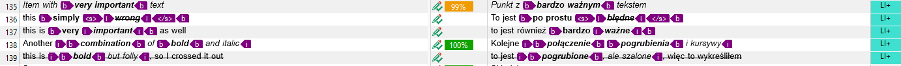

Trados Studio 2022 <!-- Images under some Figures don't display correctly, they appear as broken -->
===

# Trados — results

This section contains the results for the settings available in Trados Studio 2022.

<!-- REUSE COMP BGN -->
The results for individual settings are grouped according to the sections in the test file. If a feature is not mentioned, it means it works as intended — it was imported correctly into the editor and produced correct output in the exported file.

The test was carried out by checking the boxes in the settings. This made Trados import more features and allowed more editing. However, if a feature started working, this is noted in the relevant section.
<!-- REUSE COMP END -->

## General results

Trados sometimes does not display tags for bold, italics, or strikethrough, but shows formatted text in the editor.


*Figure 1: Trados editor with formatted text without tags*



*Figure 2: Trados editor with formatted text with tags*

Trados does not ignore non-editable elements, such as URLs, but inserts them as tags.

Trados does not render normally Markdown syntax, unless it is in code block.

<kbd>&#128680;REALLY!</kbd>:  Trados displaces hover text and changes it between links:

```
Source:
233 | [](http://www.youtube.com/watch?v=MRRmU_pOXnk "I am what I play").
...
239 | 1. The link to section on [**Bold** with a hover text is here](#bold "Bolder").

Target:
233 | [](http://www.youtube.com/watch?v=MRRmU_pOXnk "Jestem DJ-em").
...
239 | 1. Odniesienie do rozdziału [**Pogrubienie** z tekstem podpisu znajduje się tutaj](#bold "Jestem tym, co gram").
```

# [Default settings](Markdown-in-CAT-test-TS_PL-01.md)

## Basic syntax

Basic syntax works as intended.

## Links

Reference does not work: the content in round brackets in `[Składnia podstawowa](#basic-syntax)` is not translatable

## Quotations

Inline code is rendered as a tag.

Block code is rendered as a tag.

Block code with JavaScript comment is rendered as a tag.

## Extended syntax

Emoji is ignored, but it works in the output file.

Comments to be omitted are ignored.

## HTML and other tags

<kbd>&#128680;REALLY!</kbd>: text between `<code></code>` HTML tags can be translated. It was expected that it would be ignored just like inline code or code block.

<kbd>&#128680;REALLY!</kbd>: The inline code does not turn off HTML in one place, but it did in another:


*Figure 3: back tick does not work with `<p>Lorem ipsum</p>`, but it does with `<p></p>`*

<kbd>&#128680;REALLY!</kbd>: The text in `<summary>Unroll another section</summary>` is ignored. However, the rest of the content between the `<details></details>` tags is imported.

<kbd>&#128680;REALLY!</kbd>: Keyboard keys work as intended.

<kbd>&#128680;REALLY!</kbd>: Definition is ignored.

<kbd>&#128680;REALLY!</kbd>: The content of the embedded HTML section is ignored.

# [Handle line breaks as inline tags](Markdown-in-CAT-test-TS_PL-02.md)

This setting works like [default settings](#default-settings), only segmentation changed. As a result, further description is omitted.

# [Translate code blocks — embedded content plain text v 1.0.0.0](Markdown-in-CAT-test-TS_PL-03.md)

## Basic syntax

Basic syntax works as intended.

## Links

The links work as intended or as above.

## Quotations

Content of the code block can be translated.

The tags are rendered normally.

The comment in JavaScript in the code block can be translated.

The whole Java script is rendered normally.

The rest works as above.

## Extended syntax

Extended syntax works as intended or as above.

## HTML and other tags

HTML and other tags work as intended or as above.

<kbd>&#128680;REALLY!</kbd>: Because the HTML is still not imported but the content of the code block is, the content of the embedded HTML code is translated only in the code block.

# Translate code blocks — embedded content spreadsheetML v. 1

This setting generates the following error:


*Figure 3: Import error in Trados — SpreadsheetML v.1*

After trial and error, it was discovered that error is caused by backtick <code>`</code>. As a result, no study was carried out for that setting.

# [Translate code blocks — HTML embedded content 5 2.0.0.0](Markdown-in-CAT-test-TS_PL-04.md)

This setting generates the following error:


*Figure 4: Import error in Trados — HTML embedded content 5 2.0.0.0*

After trial and error, it was discovered that JavaScript code block generates the error. The JavaScript was removed to open the test file.

The quotation marks in the code block for "Definition" are rendered as `&bdquo;` in the output file.

Apart from that, the text differs in segmentation, but the general behaviour stays as in [Translate code blocks — embedded content plain text v 1.0.0.0](#Translate-code-blocks-embedded-content-plain-text-v-1.0.0.0).

As a result, no further study is carried out here.

# [Translate HTML blocks — embedded content plain text v 1.0.0.0](Markdown-in-CAT-test-TS_PL-05.md)

It is used in combination with [Translate code blocks — embedded content plain text v 1.0.0.0](#Translate-code-blocks-embedded-content-plain-text-v-1.0.0.0), because this gave the least number errors.

# Results

## Basic syntax

Basic syntax works as intended.

## Links

The links work as intended or as above.

## Quotations

Quotations work as intended or as above.

## Extended syntax

Comment `<!-- -->` is imported, but not `<!-- omit in toc -->`

The rest works as intended or as above.

## HTML and other tags

Embedded HTML is imported and can be translated. 

<kbd>&#128680;REALLY!</kbd>: However, HTML is rendered normally — the whole HTML code with all its tags.

# Translate HTML blocks — embedded content spreadsheetML v. 1

This setting generates the following error:


*Figure 5: Import error in Trados — embedded content spreadsheetML v. 1*

<kbd>&#128680;REALLY!</kbd>: The error is caused by the `<` symbol.

As a result, no study was carried out for that setting.

<!-- Brawo Trados! Tłumacz bloki HTML, ale wywalaj się na twarz na znaku {<} :D -->

# [Translate HTML blocks — HTML embedded content 5 2.0.0.0](Markdown-in-CAT-test-TS_PL-06.md)


## Basic syntax

Basic syntax works as intended.

## Links

The links work as intended or as above.

## Quotations

Quotations work as intended or as above.

## Extended syntax

<kbd>&#128680;REALLY!</kbd>: `<!-- -->` comment is ignored.

The rest works as intended or as above.

## HTML and other tags

HTML and other tags work as intended or as above.

---

Next section: [*Trados Studio 2022 — summary and recommendations*](trados-03-summary-and-recommendations.md)

---
[Back to top](#trados-results.md)
