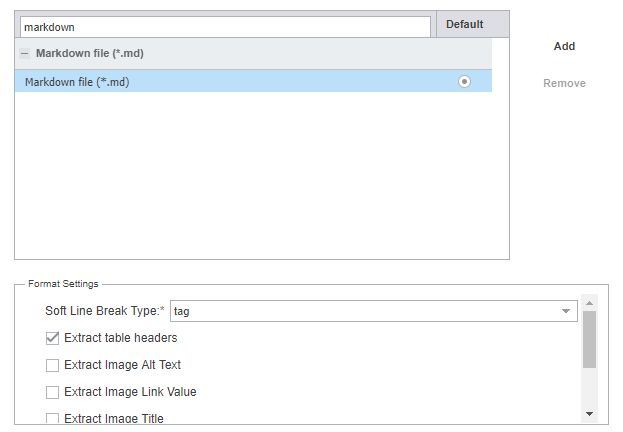

Wordfast Pro 8
===

# Settings

Wordfast Pro 8 has the following filter settings for Markdown:
1. Soft Line Break Type:
	1. tag
	2. break
	3. none
2. Extract table headers
3. Extract image alt text
4. Extract image link value
5. Extract image title
6. Extract href URL title

Default settings:
1. Soft line break type — tag
2. Extract table headers

The default settings were used as the basic settings in the study. Then, further settings were added in the order from top to bottom.

In the `Soft Line Break Type` setting, only the `tag` setting was used in the study. The `break` and `none` settings affected only segmentation rules. As a result, they were omitted in the study.

The behaviour of the settings is described in the [Wordfast — Results](wordfast-02-results.md) section.

---

Go to section: [*Wordfast — Results*](wordfast-02-results.md)

---

[Back to top](#settings)