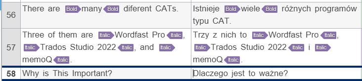

Wordfast Pro 8 <!-- Images under Figures don't display correctly, they appear as broken -->
===

# Wordfast — Results

This section contains the results for the settings available in Wordfast Pro 8.

<!-- REUSE COMP BGN -->
The results for individual settings are grouped according to the sections in the test file. If a feature is not mentioned, it means it works as intended — it was imported correctly into the editor and produced correct output in the exported file.

The test was carried out by checking the boxes in the settings. This made Wordfast Pro import more features and allowed more editing. However, if a feature started working, this is noted in the relevant section.
<!-- REUSE COMP END -->

# General results

The first obstacle with the test file was that Wordfast could not open it:


*Figure 1: error message when importing the test file*

After trial and error, it was discovered that the following lines were causing the error:
```
202 | - this **simply ~~*wrong*~~**
...
205 | 1. ~~this is *__bold__ but folly*, so I crossed it out~~
```

Interestingly, the error did not appear when the lines were turned into inline code.

It was difficult to establish what exactly caused the error. It is assumed that bold and italics next to each other within or outside strikethrough may cause it.

Different combinations of bold, italics, and strikethrough are covered in the [Wordfast Pro table error file](./resources/WF-error.md).

To continue the test, the two lines were changed into inline code and a slightly changed [test file](./resources/Markdown-in-CAT-test-Wordfast Pro.md)  was used.

Once opened, Markdown tags are displayed as in Figure 2:



*Figure 2: Markdown tags displayed in the Wordfast editor*

Wordfast Pro has difficulties with complex Markdown syntax. There are cases in which tags are rendered normally as asterisks or underscore signs, e.g., when they are combined together, they are between characters other than spaces, or they are in a table; see Figure 3.


*Figure 3: Markdown tags displayed as characters*

However, this does not affect the output file. The characters are correctly processed as Markdown tags.

The Wordfast editor has its own tools for adding simple formatting like bold or italics. However, they do not work in the segment editor. To add new text formatting, it must be entered in Markdown syntax. It is then rendered correctly in the output file.

Other general remarks on Wordfast Pro:
- it does not interpret extended syntax, like subscript, superscript, or footnote — they are ignored and rendered normally
- formatting (even standard Markdown formatting) in unrolled section is rendered as normal characters — this is most likely caused by embedding tags within HTML tags; however, some tags are rendered normally in Markdown tables
- inline code is always ignored: `this is not translatable!`

The links in the headers lead to output files — the files translated with given settings.

<!-- Tutaj pytanie @Justyna, @Monika, @Marta: dawać jeszcze mini spis treści do poszczególnych ustawień, czyli tych nagłówków z H1?

Moim zdaniem tak, ale jestem ciekaw, co myślicie :) Z góry dziękuję! -->

# [Default format settings — extract table headers](./resources/Markdown-in-CAT-test-WF_PL-01.md)

## Basic syntax

Basic syntax works as intended.

## Links

Reference is ignored and cannot be translated — this makes table of contents useless and any other references inside the file.

Image alt text in a displayed image is ignored.

Hover text is ignored.

## Quotations

Inline code is ignored.

Block code is ignored.

Block code with JavaScript comment is ignored.

## Extended syntax

<kbd>&#128680;REALLY!</kbd>: Some content in the table was deleted. As a result, it did not appear in the output file.

<kbd>&#128680;REALLY!</kbd>: Emoji was rendered as tags. It was expected that it would be either ignored or rendered normally.

Subscript is rendered normally.

Superscript is rendered normally.

Footnotes are rendered normally.

Comments to be omitted are ignored.

## HTML and other tags

<kbd>&#128680;REALLY!</kbd>: text between `<code></code>` HTML tags can be translated. It was expected that it would be ignored just like inline code or code block.

<kbd>&#128680;REALLY!</kbd>: text in the embedded HTML works as intended, including buttons.

# [Extract image alt text](./resources/Markdown-in-CAT-test-WF_PL-02.md)

## Basic syntax

Basic syntax works as intended.

## Links

Image alt text is now translatable, but not the hover text:

``

The rest works as intended or as above.

## Quotations

Quotations work as intended or as above.

## Extended syntax

Extended syntax works as intended or as above.

## HTML and other tags

HTML and other tags work as intended or as above.

# [Extract image link value](./resources/Markdown-in-CAT-test-WF_PL-03.md)

## Basic syntax

Basic syntax works as intended.

## Links

Image link values are now extracted:


*Figure 4: Image link value extracted*

The rest works as intended or as above.

## Quotations

Quotations work as intended or as above.

## Extended syntax

Extended syntax works as intended or as above.

## HTML and other tags

HTML and other tags work as intended or as above.

# [Extract image title](./resources/Markdown-in-CAT-test-WF_PL-04.md)

## Basic syntax

Basic syntax works as intended.

## Links

Hover text is extracted, but only for images:

```
1. Odniesienie do rozdziału [**Pogrubienie** z tekstem podpisu znajduje się tutaj](#bold "Bolder").

2. Odniesienie do wyświetlanego pliku graficznego w repozytorium z wyświetlanym tekstem podpisu znajduje się tutaj:


3. Odniesienie do [mojej strony Translatorion.com znajduje się tutaj](https://translatorion.com/ "I didn't choose translator's life, translator's life chose me").
```

The rest works as intended or as above.

## Quotations

Quotations work as intended or as above.

## Extended syntax

Extended syntax works as intended or as above.

## HTML and other tags

HTML and other tags work as intended or as above.

# [Extract href link URL value](./resources/Markdown-in-CAT-test-WF_PL-05.md)

## Basic syntax

Basic syntax works as intended.

## Links

<kbd>&#128680;REALLY!</kbd>: Markdown and HTML reference links are rendered semi-normally and normally, respectively. In the case of Markdown, brackets are ignored, but the hash symbol is visible in the Wordfast editor.

This means it is possible to translate e.g. a table of contents; see Figure 5.


*Figure 5: Markdown reference syntax rendered semi-normally*

The rest works as intended or as above.

## Quotations

Quotations work as intended or as above.

## Extended syntax

<kbd>&#128680;REALLY!</kbd>:  For some reason, the missing content in the table cells appeared.

The rest works as intended or as above.

## HTML and other tags

HTML and other tags work as intended or as above.

# [Extract href link URL title]((./resources/Markdown-in-CAT-test-WF_PL-06.md)

## Basic syntax

Basic syntax works as intended.

## Links

Hover text for Markdown reference and HTML links is extracted and can be translated:

```
1. Odniesienie do rozdziału [**Pogrubienie** z tekstem podpisu znajduje się tutaj](#pogrubienie "Bardziej pogrubione").

2. Odniesienie do wyświetlanego pliku graficznego w repozytorium z wyświetlanym tekstem podpisu znajduje się tutaj:


3. Odniesienie do [mojej strony Translatorion.com znajduje się tutaj](https://translatorion.com/ "Nie wybrałem życia tłumacza, życie tłumacza wybrało mnie").
```

## Quotations

Quotations work as intended or as above.

## Extended syntax

Extended syntax works as intended or as above.

## HTML and other tags

HTML and other tags work as intended or as above.


---

Next section: [*Wordfast Pro 8 — summary and recommendations*](wordfast-03-summary-and-recommendations.md)

---

[Back to top](#wordfast-pro-8)
